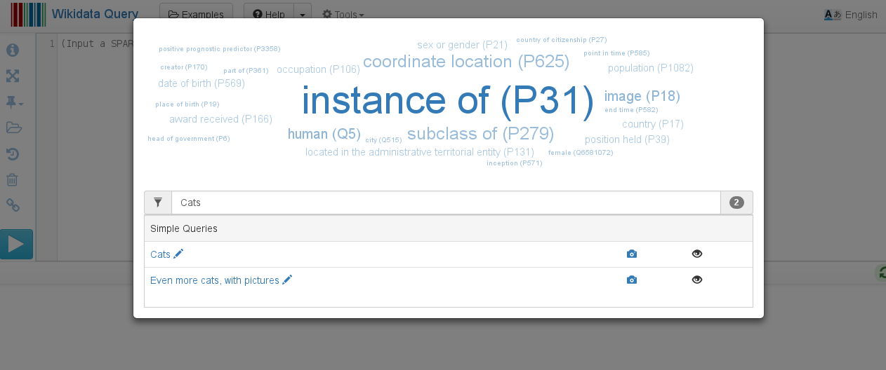
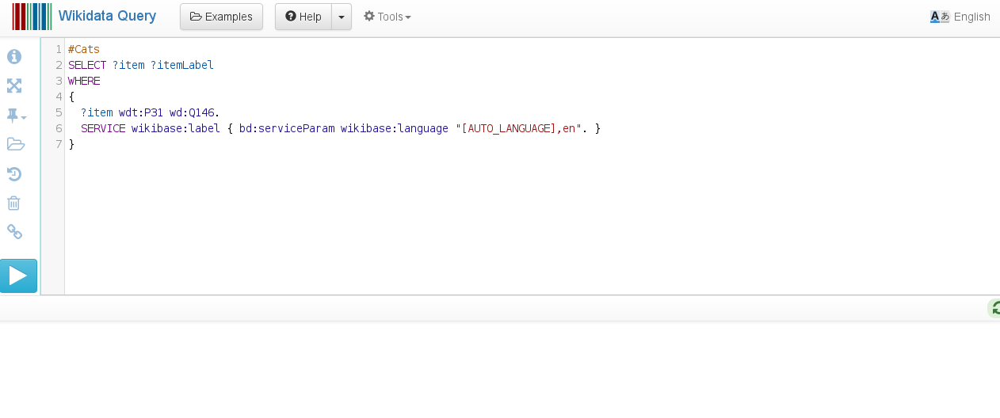
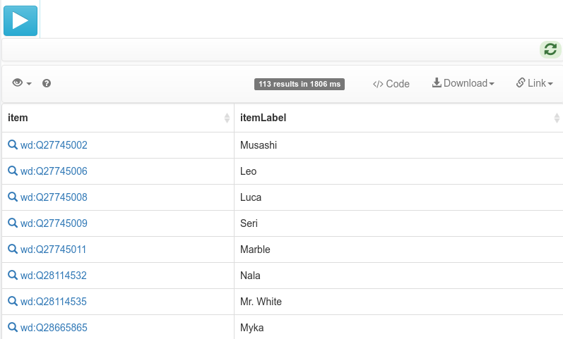
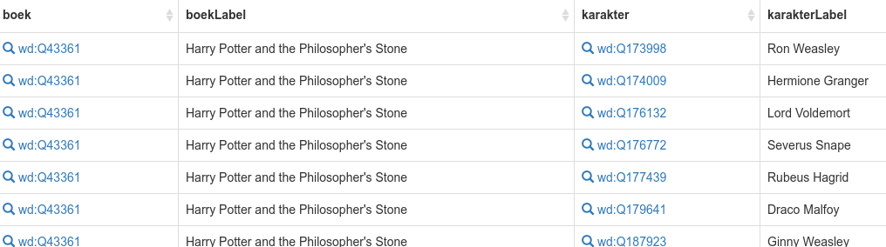
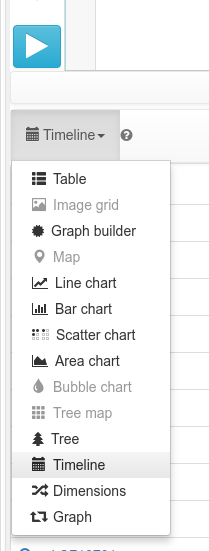
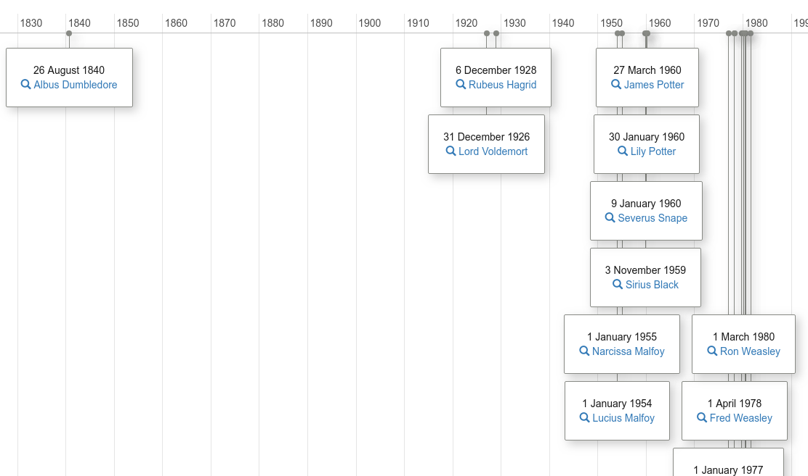
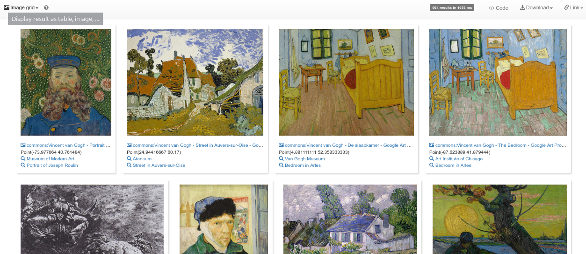
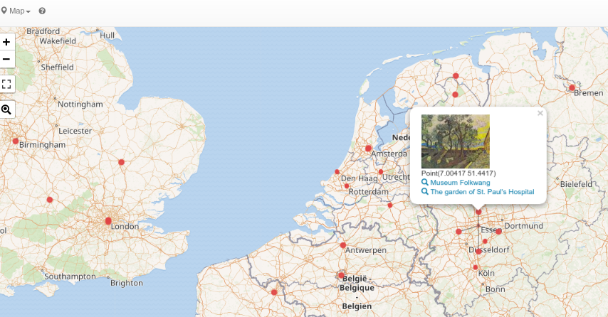
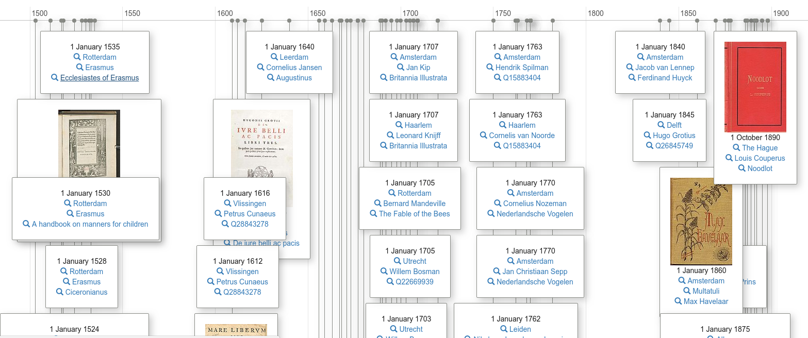
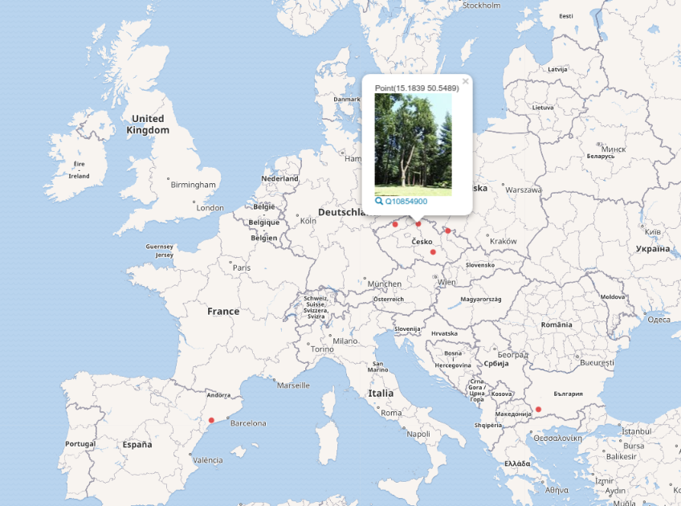

Informatie zoeken in Wikidata
=============================

In deze opdracht gaan we aan de slag met SPARQL. Dat klinkt technisch (en dat is het ook), maar het is zo handig
dat het de moeite meer dan waard is om daar ervaring mee op te doen, al is het maar om te weten wat
kan. We gaan een aantal voorbeelden doorlopen, en hierbij is het knippen en plakken van SPARQL-zoekopdrachten 
absoluut toegestaan. Sterker nog, dat is vaak beter dan het wiel opnieuw uitvinden.

Een eenvoudige zoekopdracht: Katten
-----------------------------------

In deze eerste opdracht maak je kennis met een van de manieren om informatie te zoeken in Wikidata.
Je kan natuurlijk de zoekfunctie op de [Wikidata homepage](http://wikidata.org/) gebruiken, maar met de 
[Wikidata Query Service](https://query.wikidata.org/) (WQS) kunnen we veel gerichter zoeken.
Het eerste voorbeeld is zoeken op alle katten in Wikidata. De SPARQL-zoekopdracht daarvoor
hoeven we niet zelf te verzinnen, het is namelijk een van de 300+ voorbeelden die de WQS
standaard aanbiedt onder de "Example" knop:



Als we hier de 'Cats' voorbeeld kiezen, krijgen we de bijbehorende zoekopdracht te zien:



Je kan [die zoekopdracht](https://query.wikidata.org/#%23Cats%0ASELECT%20%3Fitem%20%3FitemLabel%20%0AWHERE%20%0A%7B%0A%20%20%3Fitem%20wdt%3AP31%20wd%3AQ146.%0A%20%20SERVICE%20wikibase%3Alabel%20%7B%20bd%3AserviceParam%20wikibase%3Alanguage%20%22%5BAUTO_LANGUAGE%5D%2Cen%22.%20%7D%0A%7D)
uitvoeren door op de blauwe ''play'' knop te clicken met dit als resultaat:



Deze zoekopdracht heeft een vaste structuur, die er in grote lijnen uitziet als:

```sparql
SELECT ?resultaat WHERE {
  # zoekopdracht
}
```

We zien hier twee delen: ``SELECT`` en ``WHERE``. Het ``SELECT`` deel zegt hoe we de informatie willen zien, en het
``WHERE`` vertelt ons welke informatie we willen zien. Dat laatste is belangrijk, wat we willen niet alles zien,
maar alleen datgene dat aan onze zoekopdracht voldoet.

Bij de zoekopdracht naar katten, willen we weten welk ding (''item'') in Wikidata een kat is, en wat de
naam (''itemLabel'') van die kat is. De zoekopdracht stelt dat we alleen dingen willen die ''kat zijn''.
De ''zijn'' in die opdracht is the `wdt:P31` ([P31](https://www.wikidata.org/wiki/Property:P31) is
''instance of'', ofwel ''van het type''). De ''kat''
in die opdracht is [Q146](https://www.wikidata.org/wiki/Q146). De zoekopdracht is dus vooral:

```sparql
?item wdt:P31 wd:Q146
````

Dit kan je lezen als: alle items (''?item'') die ''van het type'' ''kat'' zijn.

En omdat Wikidata een internationale database is, gebruiken we verder nog een ''SERVICE'' om een label in
onze (zoals ingesteld in je webbrowser) taal te geven.

Dat maakt de volledige zoekopdracht in de SPARQL zoektaal:

```sparql
#Cats
SELECT ?item ?itemLabel 
WHERE 
{
  ?item wdt:P31 wd:Q146.
  SERVICE wikibase:label { bd:serviceParam wikibase:language "[AUTO_LANGUAGE],en". }
}
```

Karakters uit Harry Potter boeken
---------------------------------

De zoekopdracht naar katten is redelijk eenvoudig, maar we kunnen de opdracht steeds complexer maken.
Bijvoorbeeld, we kunnen een zoekopdracht maken die alle karakters opzoekt uit Harry Potter-boeken.
We moeten dan dus eerst weten welke boeken bij de Harry Potter serie horen. Gelukkig is er een
Wikidata item voor de [Harry Potter serie](https://www.wikidata.org/wiki/Q8337) (Q8337), zodat
we kunne zeggen welke boeken in die serie horen (P179):

```sparql
SELECT ?boek ?boekLabel WHERE {
  ?boek wdt:P179 wd:Q8337 .
  SERVICE wikibase:label { bd:serviceParam wikibase:language "[AUTO_LANGUAGE],en". }
}
```

De volgende stap is dan de link te slaan tussen een boek en de karakters in dat boek. Daar
heeft Wikidata het [personage](https://www.wikidata.org/wiki/Property:P674) (P674) eigenschap voor:

```sparql
SELECT ?boek ?boekLabel ?karakter ?karakterLabel WHERE {
  ?boek wdt:P179 wd:Q8337 .
  ?boek wdt:P674 ?karakter .
  SERVICE wikibase:label { bd:serviceParam wikibase:language "[AUTO_LANGUAGE],en". }
}
```

Dat geeft een mooie lijst:



En als je nu wil weten wanneer deze personen geboren zijn, hoeven we eigenlijk niet zo heel
veel te veranderen. We voegen een regel toe om de geboortedag op te vragen en we halen
weg dat hij zegt in welke boeken het karakter voorkomt:

```sparql
SELECT DISTINCT ?karakter ?karakterLabel ?geboortedag WHERE {
  ?boek wdt:P179 wd:Q8337 .
  ?boek wdt:P674 ?karakter .
  ?karakter wdt:P569 ?geboortedag .
  SERVICE wikibase:label { bd:serviceParam wikibase:language "[AUTO_LANGUAGE],en". }
}
```

En omdat we nu datums hebben, kunnen we dit ook als tijdslijn visualiseren ("Timeline" in het
Engels):



Het resultaat ziet er dan zo uit:



(Voor de ouders, wie is er in jouw geboortejaar geboren?)

## Meer visualisaties: Van Gogh

We hebben naast de tabel hierboven ook een tijdslijn als visualisatie mogelijkheid gezien. Maar als
we schilderijen van Van Gogh willen zien, willen we graag weten welk schilderij waar hangt. Ook over
schilderijen staat heel veel informatie in Wikidata, met dank aan de musea die tegenwoordig afbeeldingen
van schilderijen beschikbaar maken, kunnen we leuke dingen doen.

Ten eerste, we zijn dus op zoek naar schilderijen (Q3305213) die door Van Gogh (Q5582) geschilderd zijn. Dit
doen we met de zoekopdracht:

```sparql
SELECT ?schilderij ?schilderijLabel WHERE {
  ?schilderij wdt:P170 wd:Q5582 ; # door Van Gogh
              wdt:P31 wd:Q3305213 . # is een schilderij
  SERVICE wikibase:label { bd:serviceParam wikibase:language "[AUTO_LANGUAGE],en". }
}
```

Maar we hebben dus ook de locatie (P276) nodig (inclusief coordinaten (P625)),
en als het even kan een plaatje (P18) van het schilderij:

```sparql
SELECT ?schilderij ?schilderijLabel ?location ?locationLabel ?image ?coordinates WHERE {
  ?schilderij wdt:P170 wd:Q5582 ; # door Van Gogh
              wdt:P31 wd:Q3305213 ; # is een schilderij
              wdt:P276 ?location .
  ?location wdt:P625 ?coordinates . # waar hangt het?
  OPTIONAL { ?schilderij wdt:P18 ?image }
  SERVICE wikibase:label { bd:serviceParam wikibase:language "[AUTO_LANGUAGE],en". }
}
```

We zagen al eerder bij de Harry Potter karakters hoe we kunnen wisselen van de standaard tabel
naar een tijdslijn. Maar als we plaatjes hebben, kunnen we ook een overzicht van plaatjes maken
("Image Grid" in het Engels):



En omdat we ook coordinaten hebben van de lokaties hebben waar het schilderij hangt, een wereldkaart ("Map"):




Boeken van voor 1900 door auteurs die in Nederland geboren zijn
---------------------------------------------------------------

De zoekopdrachten kunnen veel meer. Bijvoorbeeld, we kunnen zoeken naar boeken die voor 1900 gepubliceerd
zijn en geschreven zijn door schrijvers die in Nederland geboren zijn:



Maar dat zijn wel heel veel stappen in een keer. We doen het step voor stap en beginnen met de zoekopdracht.
We willen dus alleen dingen die een boek zijn ([Q571](https://www.wikidata.org/wiki/Q571)). Dus we maken
een ''variabele'' en gebruiken net zoals bij de katten P31:

```sparql
?book wdt:P31 wd:Q571
```

Dit leest dus als: alle boeken (''?book'') die ''van het type'' ''boek'' zijn.

Maar we willen meer van het boek weten, zoals de auteur:

```sparql
?book wdt:P50 ?author
```

We willen ook weten wanneer het boek gepubliceerd is:

```sparql
?book wdt:P577 ?date
```

Bovendien moet de auteur in een plaats (P19 is ''geboorteplaats'')
in Nederland (Q55) (P17 is ''land'') geboren zijn:

```sparql
?author  wdt:P19 ?birthPlace .
?birthPlace wdt:P17 wd:Q55 .
```

Daarmee is de hele zoekopdracht:

```sparql
#defaultView:Timeline
SELECT ?book ?bookLabel ?date ?author ?authorLabel ?birthPlace ?birthPlaceLabel ?image WHERE {
  VALUES ?bookType { wd:Q571 wd:Q3331189 }
  ?book wdt:P50 ?author ; wdt:P31 ?bookType ; wdt:P577 ?date .
  OPTIONAL { ?book wdt:P18 ?image }
  ?author wdt:P19 ?birthPlace .
  ?birthPlace wdt:P17 wd:Q55 .
  SERVICE wikibase:label { bd:serviceParam wikibase:language "[AUTO_LANGUAGE],en". }
  FILTER (year(?date) < 1900)
}
```

## Beroemde dennebomen in Europa

Een laatste zoekopdracht dan, over beroemde dennebomen (Q12024). Die zijn er niet zo heel veel, maar toch een paar:



De bijbehorende zoekopdracht is:

```sparql
#defaultView:Map
SELECT ?tree ?treeLabel ?location ?image WHERE {
  { ?tree wdt:P279+|wdt:P31+/wdt:P171 wd:Q12024 }
  UNION
  { ?tree wdt:P279+|wdt:P31+ wd:Q12024 }
  ?tree wdt:P18 ?image ; wdt:P625 ?location .
  SERVICE wikibase:label { bd:serviceParam wikibase:language "[AUTO_LANGUAGE],en". }
}
```

Opdracht: kan jij deze zoekopdracht aanpassen zodat hij beroemde eikenbomen laat zien?

## Tot slot

Een zoekopdracht kan echter op een gegeven moment te moeilijk worden om in kort tijd uit te voeren in de database.
Er zijn dan wel wat trucjes, maar die vallen buiten de inhoud van deze workshop.

