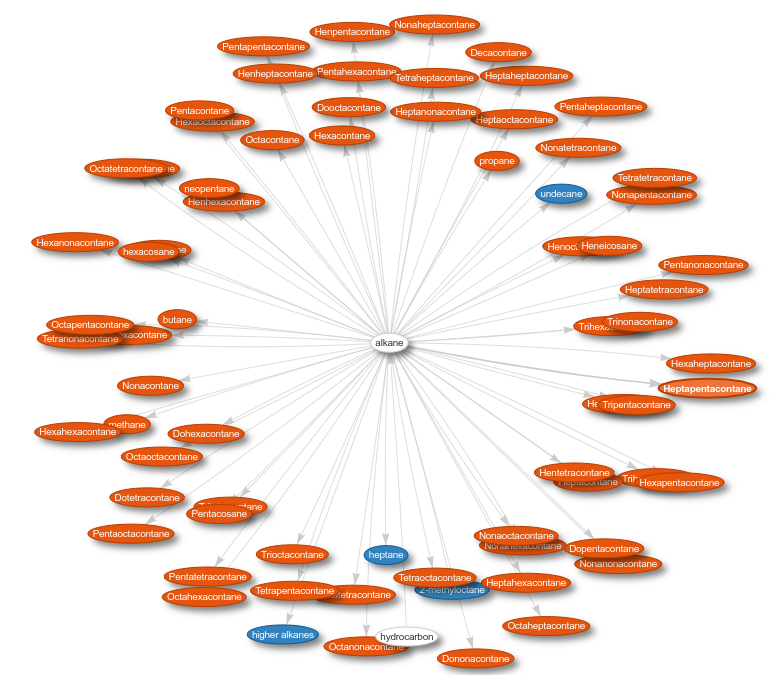
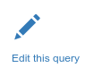

# Scholia

[Scholia](https://tools.wmflabs.org/scholia/) is een webtoepassing die data uit Wikidata gebruikt om wetenschappelijke
literatuur makkelijker toegankelijk te maken. Het is bedacht en ontwikkelt door een onderzoeker uit Denenmarken,
[Finn Nielsen](https://tools.wmflabs.org/scholia/author/Q20980928).

De toepassing laat je bladeren door artikelen, tijdschriften, onderzoekers, soorten, en onderwerpen. Een paar voorbeelden:

* [Zika](https://tools.wmflabs.org/scholia/disease/Q8071861)
* [Ben Feringa](https://tools.wmflabs.org/scholia/author/Q3259614)
* [de Neanderthaler](https://tools.wmflabs.org/scholia/taxon/Q40171)
* [Rembrandt van Rijn](https://tools.wmflabs.org/scholia/author/Q5598) (niet veel geschreven, maar wel voor werken)
* [aspirine](https://tools.wmflabs.org/scholia/chemical/Q18216) (een medicijn)
* [alkanen](https://tools.wmflabs.org/scholia/chemical-class/Q41581) (een groep van chemische verbindingen)

## Opdracht: Onderwerpen opzoeken in Scholia

De Scholia toepassing geeft de mogelijkheid om op de voorpagina een zoekopdracht uit te voeren.
Zo kan je bijvoorbeeld zoeken op Zika:

Maar je kan natuurlijk van alles opzoeken. De opdracht is om iets op te zoeken wat jij interessant vindt.

## Opdracht: Welke informatie vinden we via Scholia

Scholia heeft dus een aantal verschillende soorten pagina's, zoals je bovenaan kan zien. Dat wil zeggen,
voor auteurs geeft het andere informatie dan voor een medicijn en groep van chemische verbindingen.
Dit doet het door voor elk soort onderwerp andere zoekopdrachten uit te voeren. Bijvoorbeeld:

De zoekopdrachten die daar achter zitten, zijn vaak flink ingewikkeld, maar wel altijd in detail te
bestuderen. Klik maar eens op de "Edit this" link:

